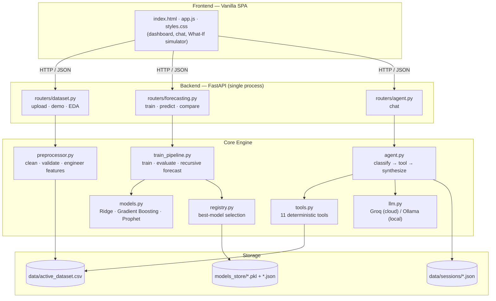
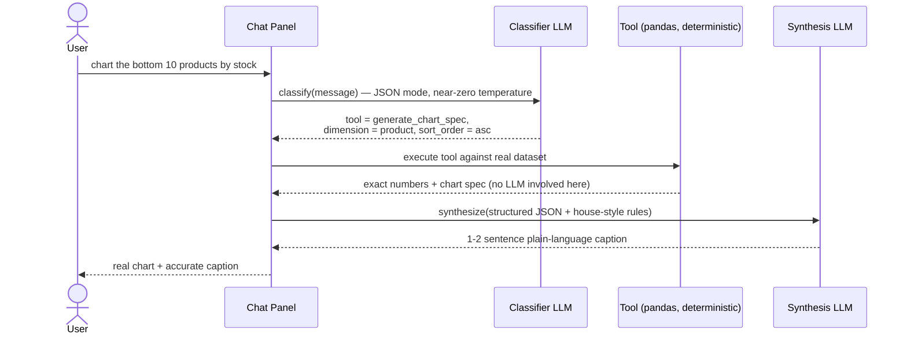
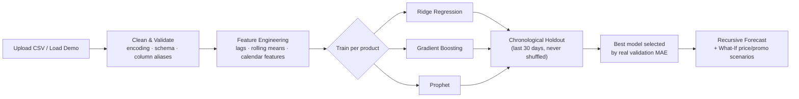

<div align="center">

# 🛒 InsightForge

### AI-Powered Retail Decision Support System

*Smarter Decisions. Stronger Stores.*


InsightForge turns a raw retail sales CSV into a demand forecast, a business-intelligence
dashboard, and a conversational AI analyst — with zero SQL, zero ML jargon on screen,
and zero manual chart-building.

</div>

---

## Contents

- [What it does](#what-it-does)
- [Key Features](#-key-features)
- [Architecture](#-architecture)
- [How the AI Chat Actually Works](#-how-the-ai-chat-actually-works-no-hallucinated-numbers)
- [Forecasting Pipeline](#-forecasting-pipeline)
- [Project Structure](#-project-structure)
- [Setup & Installation](#-setup--installation)
- [Technical Presentation & Viva Guide](#-technical-presentation--viva-guide)
- [Further Reading](#-further-reading)

---

## What it does

Upload a retail sales CSV (or load the built-in 2-year synthetic demo dataset) and
InsightForge gives a store manager three things, in order of how they'd actually use them:

1. **A daily recommendation** — what to reorder, what's at risk, in plain English, before any chart.
2. **A forecast they can poke at** — pick a product, see the demand curve, then drag a price
   slider or toggle promo days and watch the same chart update with a real number attached.
3. **A chat they can just ask** — "why did shampoo sales drop?", "compare milk and bread",
   "chart the bottom 10 products by stock" — answered from real pandas aggregations, never a
   guessed number.

Everything ML-flavored (model names, MAE/MAPE/R², feature importance-adjacent detail) is
available on demand behind a collapsed **"Advanced Technical Details"** section — not hidden,
just not in the way of someone who isn't a data scientist.

---

## 🌟 Key Features

**Data Hub**
- CSV upload with real-world robustness: non-UTF-8 encodings (Windows-1252/BOM), genuine
  `.xlsx`/`.xls` files saved with a `.csv` extension (detected by magic bytes, not trusted
  by filename), and several real-world price-column aliases (`selling_price`, `base_price`,
  `unit_price`).
- Built-in **Retail Simulator Demo** — 2 years of realistic seasonal retail demand, no upload needed.
- Dataset Health Check with plain-language warnings; one-click Clear Dataset for a fresh start.

**Sales Insights** (Business Intelligence dashboard)
- Filterable by product, category, and date range, backing 10+ curated charts: sales trend,
  weekly/monthly seasonality, top products, revenue by category, inventory health, fast/slow
  movers, promotion impact.
- Every chart has an **Explain** button — the AI Analyst summarizes it in plain language on demand.
- Automatic anomaly detection (IQR method), with optional outlier smoothing before training.

**Forecasting Engine**
- **Ridge Regression + Gradient Boosting + Prophet**, evaluated against each other on a
  chronological 30-day holdout (never a random shuffle — that would leak the future into
  the past) — the best model per product is picked from real validation error, never hardcoded.
- **What-If Simulator**: adjust price (±30%) and toggle future promo days, see the scenario
  forecast plotted against the baseline, save named scenarios for comparison.
- Plain-language "Forecast Confidence" (not a bare accuracy percentage) plus concrete business
  output — reorder quantity, stockout risk, revenue at risk.

**AI Retail Analyst**
- A resizable chat panel (11 structured tools — sales summaries, stockout alerts, model
  comparisons, forecast decomposition, and more) that **never runs arbitrary code**: every
  number comes from a fixed, deterministic pandas function, not an LLM guess.
- **Chat-generated charts** — ask for one in plain English and get a real Plotly chart back,
  built from the same aggregation logic as the dashboard, so the two never disagree. Supports
  "top" *and* "lowest/worst" ranking requests.
- Plain business language by default; only reaches for MAE/MAPE/R² if you ask a technical question.

**Learning Center**
- ML explainer cards that lead with the business question ("How far off are my forecasts, on
  average?"), with the formula/technical definition available underneath for viva prep.

---

## 🏗 Architecture



One FastAPI process serves the API *and* the static frontend (`StaticFiles` mount) — no
separate frontend server, no CORS setup, one port to run for a demo.

---

## 🤖 How the AI Chat Actually Works (no hallucinated numbers)

The single most important design decision in this project: **the LLM never computes a
number.** It only ever picks *which* deterministic tool to call and *how* to phrase the
answer — every value in the response comes from a real pandas aggregation.



This two-stage split (classify, then synthesize) means a routing mistake produces a wrong
*tool choice*, never a fabricated *number* — the synthesis LLM is explicitly instructed to
translate the structured data it's handed, not invent anything beyond it.

---

## 📈 Forecasting Pipeline



Ridge and Gradient Boosting are evaluated with a **recursive walk-forward** loop (each
day's prediction feeds the next day's lag features, exactly like real deployment) —
Prophet is evaluated natively, since forcing a global additive model through a recursive
lag loop would be both incorrect and meaningless. See
[`engineering_handoff.md`](engineering_handoff.md) §5 and §9 for the full reasoning.

---

## 📁 Project Structure

```
backend/
  main.py                # FastAPI entry point; router mounting; static file serving
  requirements.txt       # Pinned Python dependencies
  data/                  # Active dataset, demo dataset, per-session chat history
  models_store/          # Trained model files (.pkl), registry index, training reports
  routers/
    dataset.py           # /api/dataset/*    — upload, demo, status, preview, EDA
    forecasting.py       # /api/forecast/*   — train, report, predict, compare
    agent.py             # /api/agent/*      — chat
  core/
    forecasting/
      preprocessor.py    # Schema detection, cleaning, lag/rolling feature engineering
      models.py          # Ridge Regression, Gradient Boosting, Prophet wrappers
      train_pipeline.py  # Training orchestration, evaluation, recursive forecasting
      registry.py        # Model persistence, best-model selection, recommendation text
      synthetic_data.py  # 2-year demo dataset generator
    agent/
      agent.py           # Two-stage pipeline: classify -> execute tool -> synthesize
      tools.py           # 11 deterministic analyst tools (sales, stock, forecasts, charts)
      llm.py             # Unified Groq/Ollama client + session memory
  scratch/                # Verification scripts (not a real test suite, no CI)
frontend/
  index.html              # Single-page app shell (dashboard, chat, modals)
  styles.css              # Dark glassmorphic theme, responsive breakpoints
  app.js                  # SPA state machine, Plotly rendering, chat coordinator
```

---

## 🚀 Setup & Installation

### 1. Virtual Environment & Dependencies

```powershell
python -m venv venv
.\venv\Scripts\Activate.ps1
python -m pip install --upgrade pip
pip install -r backend/requirements.txt
```

### 2. Configure Environment Variables

Create `.env` in the project root:

```env
# Provider: 'groq' (free-tier cloud API) or 'ollama' (fully local, offline)
LLM_PROVIDER=groq

GROQ_API_KEY=your_actual_groq_api_key_here
GROQ_MODEL=llama-3.3-70b-versatile

OLLAMA_HOST=http://127.0.0.1:11434
OLLAMA_MODEL=llama3
```

### 3. Run Diagnostics (optional but recommended)

```powershell
python backend/scratch/verify_pipeline.py    # preprocessing pipeline
python backend/scratch/verify_training.py    # model training + forecast generation
python backend/scratch/verify_agent.py       # all 11 AI Analyst tools
```

### 4. Start the Server

```powershell
uvicorn backend.main:app --host 127.0.0.1 --port 8000 --reload
```

Open **[http://localhost:8000/](http://localhost:8000/)** and either load the demo dataset
or upload your own CSV.

---

## 📊 Technical Presentation & Viva Guide

Talking points for explaining the ML/engineering content in a presentation or defense:

- **Chronological train/test split**: shuffling randomly leaks future information into past
  metrics. Training on early dates and validating on the final 30 days matches how the
  model will actually be used in deployment.
- **Recursive multi-step forecasting**: for Ridge and Gradient Boosting, future lag features
  aren't hardcoded — each predicted day $T+1$ is appended to the sales buffer and used to
  construct the lag features for predicting day $T+2$, and so on.
- **Confidence intervals**: Prophet supplies native Bayesian credible intervals; Ridge and
  Gradient Boosting use $\hat{y} \pm 1.96 \cdot \sigma_e \cdot \sqrt{\text{step}}$, where
  $\sigma_e$ is the training residual standard deviation and the $\sqrt{\text{step}}$ term
  grows the interval with forecast horizon.
- **Why three models, not one**: real validation across products shows no single model
  dominates (win distribution roughly splits across all three depending on the product's
  seasonality strength and price signal) — a single "best in the world" model would need
  *more* data than a smaller dataset provides, not less.
- **Security & determinism in the AI chat**: the analyst LLM never executes arbitrary
  code or computes numbers itself — it classifies intent, a fixed backend tool computes the
  real answer from the actual data, and the LLM only translates that structured result into
  language. This is also what prevents prompt-injection-style attacks from doing anything
  beyond picking the wrong (still safe) tool.

---

## 📚 Further Reading

[`engineering_handoff.md`](engineering_handoff.md) is the full technical deep-dive — complete
API reference, ML pipeline internals, every architectural decision and why, known
limitations, and a version-by-version history of what changed and why across the project's
development. This README is the quick orientation; that document is the authoritative one.
